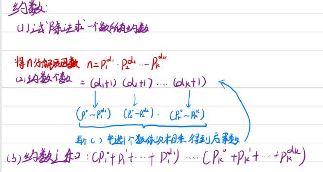

##### 1. 试除法求约数

 	约数是成对出现的 如果n%i==0  当n!=i^2^时 n/i也是n的约数

``` c++
vector<int>ans;
for(int i=1;i<=n/i;i++)
if(n%i==0)ans.push_back(i);
```

##### 2.约数个数

##### 3.约数之和

二者都需要先分解质因数




2.约数个数

```c++
#include<bits/stdc++.h>
using namespace std;
const int  mod =1e9+7;
unordered_map<int,int>mp;
int main()
{
    int n;cin>>n;
    while (n -- )
    {
        int x;cin>>x;
        for (int i = 2; i <= x/i; i ++ )
        {
            while(x%i==0)
            {   
                x/=i;
                mp[i]++;
            }
            
        }
        if(x>1)mp[x]++;
       
    }
        long long res=1;
        for(auto p:mp)
        {
            res=res * (p.second+1) % mod;
        }
        cout <<res<<endl;
    
    return 0;
}
```

3.约数之和

```c++
#include<bits/stdc++.h>
using namespace std;
const int  mod =1e9+7;
typedef long long LL;

unordered_map<int,int>mp;
int main()
{
    int n;cin>>n;
    while (n -- )
    {
        int x;cin>>x;
        for (int i = 2; i <= x/i; i ++ )
        {
            while(x%i==0)
            {   
                x/=i;
                mp[i]++;
            }
            
        }
        if(x>1)mp[x]++;
       
    }
        long long res=1;
        for(auto p:mp)
        {
            int a=p.second;
            LL t=1;
            while(a--)t=(t*p.first+1)%mod;//求多项式和
            res=res*t%mod;
        }
        cout <<res<<endl;
    
    return 0;
}
```


##### 欧几里得算法(gcd) 

也叫辗转相除法

````c++
int gcd(int a,int b)
{
	return b?gcd(b,a%b):a;
}
````


